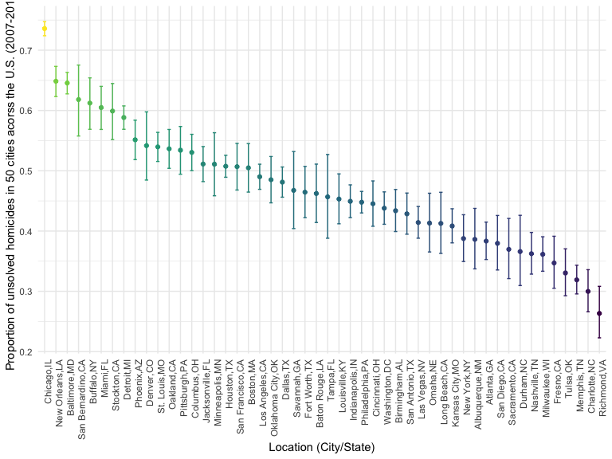

P8105_hw5_hm2947
================
Matthew Ma
2022-11-16

## Problem 1

The code chunk below imports the data in individual spreadsheets
contained in `./data/zip_data/`. To do this, I create a dataframe that
includes the list of all files in that directory and the complete path
to each file. As a next step, I `map` over paths and import data using
the `read_csv` function. Finally, I `unnest` the result of `map`.

``` r
full_df = 
  tibble(
    files = list.files("data/zip_data/"),
    path = str_c("data/zip_data/", files)
  ) %>% 
  mutate(data = map(path, read_csv)) %>% 
  unnest()
```

    ## Rows: 1 Columns: 8
    ## ── Column specification ────────────────────────────────────────────────────────
    ## Delimiter: ","
    ## dbl (8): week_1, week_2, week_3, week_4, week_5, week_6, week_7, week_8
    ## 
    ## ℹ Use `spec()` to retrieve the full column specification for this data.
    ## ℹ Specify the column types or set `show_col_types = FALSE` to quiet this message.
    ## Rows: 1 Columns: 8
    ## ── Column specification ────────────────────────────────────────────────────────
    ## Delimiter: ","
    ## dbl (8): week_1, week_2, week_3, week_4, week_5, week_6, week_7, week_8
    ## 
    ## ℹ Use `spec()` to retrieve the full column specification for this data.
    ## ℹ Specify the column types or set `show_col_types = FALSE` to quiet this message.
    ## Rows: 1 Columns: 8
    ## ── Column specification ────────────────────────────────────────────────────────
    ## Delimiter: ","
    ## dbl (8): week_1, week_2, week_3, week_4, week_5, week_6, week_7, week_8
    ## 
    ## ℹ Use `spec()` to retrieve the full column specification for this data.
    ## ℹ Specify the column types or set `show_col_types = FALSE` to quiet this message.
    ## Rows: 1 Columns: 8
    ## ── Column specification ────────────────────────────────────────────────────────
    ## Delimiter: ","
    ## dbl (8): week_1, week_2, week_3, week_4, week_5, week_6, week_7, week_8
    ## 
    ## ℹ Use `spec()` to retrieve the full column specification for this data.
    ## ℹ Specify the column types or set `show_col_types = FALSE` to quiet this message.
    ## Rows: 1 Columns: 8
    ## ── Column specification ────────────────────────────────────────────────────────
    ## Delimiter: ","
    ## dbl (8): week_1, week_2, week_3, week_4, week_5, week_6, week_7, week_8
    ## 
    ## ℹ Use `spec()` to retrieve the full column specification for this data.
    ## ℹ Specify the column types or set `show_col_types = FALSE` to quiet this message.
    ## Rows: 1 Columns: 8
    ## ── Column specification ────────────────────────────────────────────────────────
    ## Delimiter: ","
    ## dbl (8): week_1, week_2, week_3, week_4, week_5, week_6, week_7, week_8
    ## 
    ## ℹ Use `spec()` to retrieve the full column specification for this data.
    ## ℹ Specify the column types or set `show_col_types = FALSE` to quiet this message.
    ## Rows: 1 Columns: 8
    ## ── Column specification ────────────────────────────────────────────────────────
    ## Delimiter: ","
    ## dbl (8): week_1, week_2, week_3, week_4, week_5, week_6, week_7, week_8
    ## 
    ## ℹ Use `spec()` to retrieve the full column specification for this data.
    ## ℹ Specify the column types or set `show_col_types = FALSE` to quiet this message.
    ## Rows: 1 Columns: 8
    ## ── Column specification ────────────────────────────────────────────────────────
    ## Delimiter: ","
    ## dbl (8): week_1, week_2, week_3, week_4, week_5, week_6, week_7, week_8
    ## 
    ## ℹ Use `spec()` to retrieve the full column specification for this data.
    ## ℹ Specify the column types or set `show_col_types = FALSE` to quiet this message.
    ## Rows: 1 Columns: 8
    ## ── Column specification ────────────────────────────────────────────────────────
    ## Delimiter: ","
    ## dbl (8): week_1, week_2, week_3, week_4, week_5, week_6, week_7, week_8
    ## 
    ## ℹ Use `spec()` to retrieve the full column specification for this data.
    ## ℹ Specify the column types or set `show_col_types = FALSE` to quiet this message.
    ## Rows: 1 Columns: 8
    ## ── Column specification ────────────────────────────────────────────────────────
    ## Delimiter: ","
    ## dbl (8): week_1, week_2, week_3, week_4, week_5, week_6, week_7, week_8
    ## 
    ## ℹ Use `spec()` to retrieve the full column specification for this data.
    ## ℹ Specify the column types or set `show_col_types = FALSE` to quiet this message.
    ## Rows: 1 Columns: 8
    ## ── Column specification ────────────────────────────────────────────────────────
    ## Delimiter: ","
    ## dbl (8): week_1, week_2, week_3, week_4, week_5, week_6, week_7, week_8
    ## 
    ## ℹ Use `spec()` to retrieve the full column specification for this data.
    ## ℹ Specify the column types or set `show_col_types = FALSE` to quiet this message.
    ## Rows: 1 Columns: 8
    ## ── Column specification ────────────────────────────────────────────────────────
    ## Delimiter: ","
    ## dbl (8): week_1, week_2, week_3, week_4, week_5, week_6, week_7, week_8
    ## 
    ## ℹ Use `spec()` to retrieve the full column specification for this data.
    ## ℹ Specify the column types or set `show_col_types = FALSE` to quiet this message.
    ## Rows: 1 Columns: 8
    ## ── Column specification ────────────────────────────────────────────────────────
    ## Delimiter: ","
    ## dbl (8): week_1, week_2, week_3, week_4, week_5, week_6, week_7, week_8
    ## 
    ## ℹ Use `spec()` to retrieve the full column specification for this data.
    ## ℹ Specify the column types or set `show_col_types = FALSE` to quiet this message.
    ## Rows: 1 Columns: 8
    ## ── Column specification ────────────────────────────────────────────────────────
    ## Delimiter: ","
    ## dbl (8): week_1, week_2, week_3, week_4, week_5, week_6, week_7, week_8
    ## 
    ## ℹ Use `spec()` to retrieve the full column specification for this data.
    ## ℹ Specify the column types or set `show_col_types = FALSE` to quiet this message.
    ## Rows: 1 Columns: 8
    ## ── Column specification ────────────────────────────────────────────────────────
    ## Delimiter: ","
    ## dbl (8): week_1, week_2, week_3, week_4, week_5, week_6, week_7, week_8
    ## 
    ## ℹ Use `spec()` to retrieve the full column specification for this data.
    ## ℹ Specify the column types or set `show_col_types = FALSE` to quiet this message.
    ## Rows: 1 Columns: 8
    ## ── Column specification ────────────────────────────────────────────────────────
    ## Delimiter: ","
    ## dbl (8): week_1, week_2, week_3, week_4, week_5, week_6, week_7, week_8
    ## 
    ## ℹ Use `spec()` to retrieve the full column specification for this data.
    ## ℹ Specify the column types or set `show_col_types = FALSE` to quiet this message.
    ## Rows: 1 Columns: 8
    ## ── Column specification ────────────────────────────────────────────────────────
    ## Delimiter: ","
    ## dbl (8): week_1, week_2, week_3, week_4, week_5, week_6, week_7, week_8
    ## 
    ## ℹ Use `spec()` to retrieve the full column specification for this data.
    ## ℹ Specify the column types or set `show_col_types = FALSE` to quiet this message.
    ## Rows: 1 Columns: 8
    ## ── Column specification ────────────────────────────────────────────────────────
    ## Delimiter: ","
    ## dbl (8): week_1, week_2, week_3, week_4, week_5, week_6, week_7, week_8
    ## 
    ## ℹ Use `spec()` to retrieve the full column specification for this data.
    ## ℹ Specify the column types or set `show_col_types = FALSE` to quiet this message.
    ## Rows: 1 Columns: 8
    ## ── Column specification ────────────────────────────────────────────────────────
    ## Delimiter: ","
    ## dbl (8): week_1, week_2, week_3, week_4, week_5, week_6, week_7, week_8
    ## 
    ## ℹ Use `spec()` to retrieve the full column specification for this data.
    ## ℹ Specify the column types or set `show_col_types = FALSE` to quiet this message.
    ## Rows: 1 Columns: 8
    ## ── Column specification ────────────────────────────────────────────────────────
    ## Delimiter: ","
    ## dbl (8): week_1, week_2, week_3, week_4, week_5, week_6, week_7, week_8
    ## 
    ## ℹ Use `spec()` to retrieve the full column specification for this data.
    ## ℹ Specify the column types or set `show_col_types = FALSE` to quiet this message.

The result of the previous code chunk isn’t tidy – data are wide rather
than long, and some important variables are included as parts of others.
The code chunk below tides the data using string manipulations on the
file, converting from wide to long, and selecting relevant variables.

``` r
tidy_df = 
  full_df %>% 
  mutate(
    files = str_replace(files, ".csv", ""),
    group = str_sub(files, 1, 3)) %>% 
  pivot_longer(
    week_1:week_8,
    names_to = "week",
    values_to = "outcome",
    names_prefix = "week_") %>% 
  mutate(week = as.numeric(week)) %>% 
  select(group, subj = files, week, outcome)
```

Finally, the code chunk below creates a plot showing individual data,
faceted by group.

``` r
tidy_df %>% 
  ggplot(aes(x = week, y = outcome, group = subj, color = group)) + 
  geom_point() + 
  geom_path() + 
  facet_grid(~group)
```


This plot suggests high within-subject correlation – subjects who start
above average end up above average, and those that start below average
end up below average. Subjects in the control group generally don’t
change over time, but those in the experiment group increase their
outcome in a roughly linear way.

## Problem 2

### Data cleaning and tidying process

``` r
homicide_raw <- read_csv("https://raw.githubusercontent.com/washingtonpost/data-homicides/master/homicide-data.csv") %>% 
  janitor::clean_names() %>%
  mutate(
    state = toupper(state),
    city_state = str_c(city, state, sep = ",") %>% 
    str_replace("Tulsa, AL", "Tulsa, OK"))
```

    ## Rows: 52179 Columns: 12
    ## ── Column specification ────────────────────────────────────────────────────────
    ## Delimiter: ","
    ## chr (9): uid, victim_last, victim_first, victim_race, victim_age, victim_sex...
    ## dbl (3): reported_date, lat, lon
    ## 
    ## ℹ Use `spec()` to retrieve the full column specification for this data.
    ## ℹ Specify the column types or set `show_col_types = FALSE` to quiet this message.

``` r
homicide_tidy = 
  homicide_raw %>% 
  mutate(
    status = ifelse(
    disposition == "Closed without arrest" | disposition == "Open/No arrest", "Solved", "Unsolved" )) %>% 
  group_by(city_state) %>% 
  summarise(n_unsolved = sum(status == "Unsolved"),
            n_total = n())

homicide_tidy
```

    ## # A tibble: 51 × 3
    ##    city_state     n_unsolved n_total
    ##    <chr>               <int>   <int>
    ##  1 Albuquerque,NM        232     378
    ##  2 Atlanta,GA            600     973
    ##  3 Baltimore,MD         1002    2827
    ##  4 Baton Rouge,LA        228     424
    ##  5 Birmingham,AL         453     800
    ##  6 Boston,MA             304     614
    ##  7 Buffalo,NY            202     521
    ##  8 Charlotte,NC          481     687
    ##  9 Chicago,IL           1462    5535
    ## 10 Cincinnati,OH         385     694
    ## # … with 41 more rows

There are 52179 observations of 13 variables regarding the homicide in
50 cities from different states across the U.S. Variables include
homicides’ information including sex, race, age, and location of the
crimes. By creating `city_state` variable, there are some variances
among the variable where some of the state name are not fully
capitalized and that the city Tulsa are misplaced into the state “AL”
instead of “OK”. We fix it in the code chunk above.

### Baltimore prop test estimate

We create a function `myproptest` instead of setting up x and y
separately to estimate the proportion of Baltimore, MD.

``` r
baltimore = 
  homicide_tidy %>% 
  filter(city_state == "Baltimore,MD")

pt_f = function(n_unsolved, n_total) {
  prop.test(n_unsolved, n_total, p = 0.5, alternative = "two.sided") %>%
    broom::tidy() %>%
    select(estimate, conf.low, conf.high)}

baltimore_prop =
  pt_f(pull(baltimore, n_unsolved), pull(baltimore, n_total)) %>%
  rename(lower_limit = conf.low,
    upper_limit = conf.high)
baltimore_prop
```

    ## # A tibble: 1 × 3
    ##   estimate lower_limit upper_limit
    ##      <dbl>       <dbl>       <dbl>
    ## 1    0.354       0.337       0.372

### Every city prop test estimate

``` r
homicide_prop = 
  homicide_tidy %>% 
  mutate(prop_homicide = map2(n_unsolved, n_total, ~ prop.test(.x, .y) %>%
      broom::tidy())) %>%
  unnest(prop_homicide) %>%
  select(city_state, estimate, conf.low, conf.high) %>%
  rename(
    lower_limit = conf.low,
    upper_limit = conf.high)

homicide_prop
```

    ## # A tibble: 51 × 4
    ##    city_state     estimate lower_limit upper_limit
    ##    <chr>             <dbl>       <dbl>       <dbl>
    ##  1 Albuquerque,NM    0.614       0.562       0.663
    ##  2 Atlanta,GA        0.617       0.585       0.647
    ##  3 Baltimore,MD      0.354       0.337       0.372
    ##  4 Baton Rouge,LA    0.538       0.489       0.586
    ##  5 Birmingham,AL     0.566       0.531       0.601
    ##  6 Boston,MA         0.495       0.455       0.535
    ##  7 Buffalo,NY        0.388       0.346       0.431
    ##  8 Charlotte,NC      0.700       0.664       0.734
    ##  9 Chicago,IL        0.264       0.253       0.276
    ## 10 Cincinnati,OH     0.555       0.517       0.592
    ## # … with 41 more rows

The resulting dataframe `homicide_prop` contains 51 results of all 50
cities which contains the estimates and confidence intervals.

### Creating a plot to show the estimates and CIs for each city

``` r
homicide_prop %>%
  mutate(
    city_state = fct_reorder(city_state, estimate, .desc = TRUE)) %>% 
  ggplot(aes(x = city_state, y = estimate, color = estimate)) +
  geom_point() +
  geom_errorbar(aes(ymin = lower_limit, ymax = upper_limit, width = .3)) +
  theme(axis.text.x = element_text(angle = 90, hjust = 1), legend.position = "none") +
  labs(
    x = "Location (City/State)",
    y = "Proportion of unsolved homicides in 50 cities acorss the U.S. (2007-2017)"
  )
```



## Problem 3
